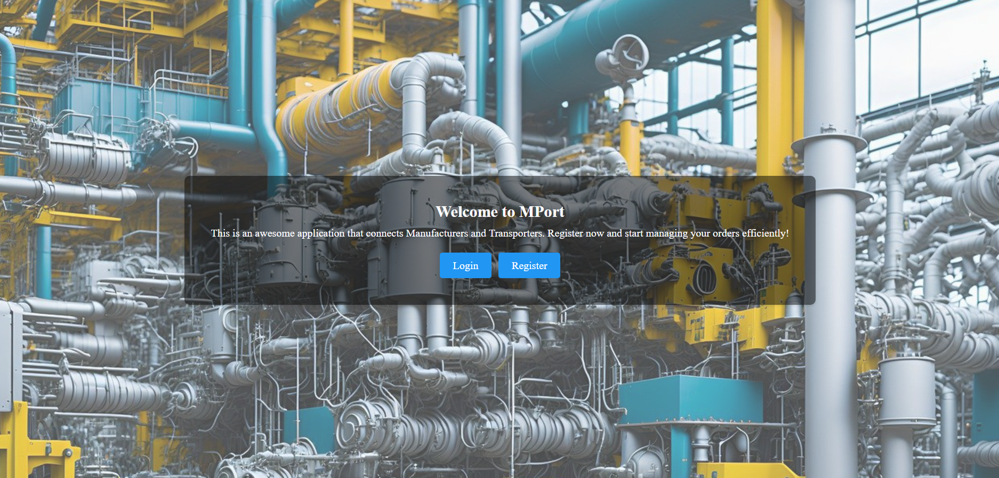
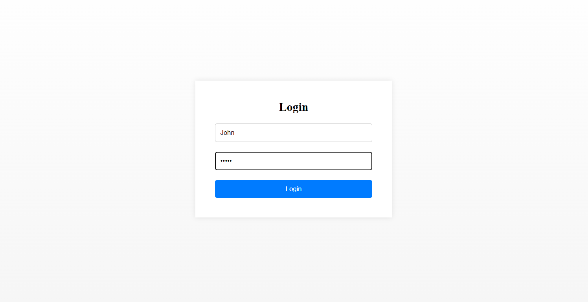
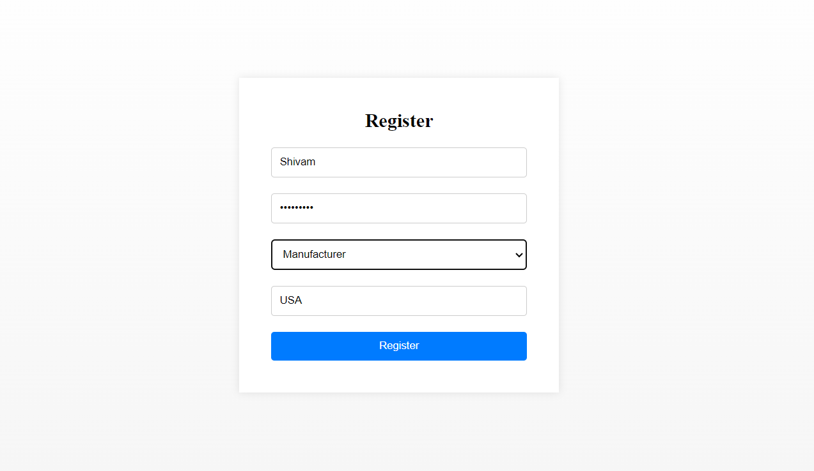
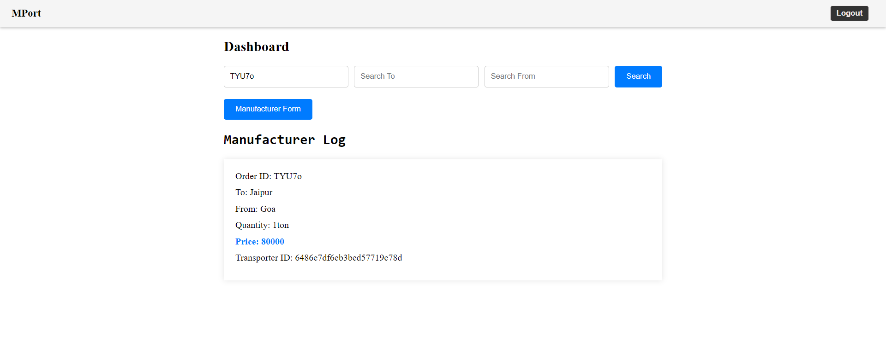
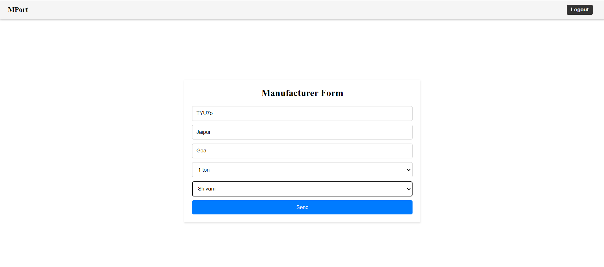
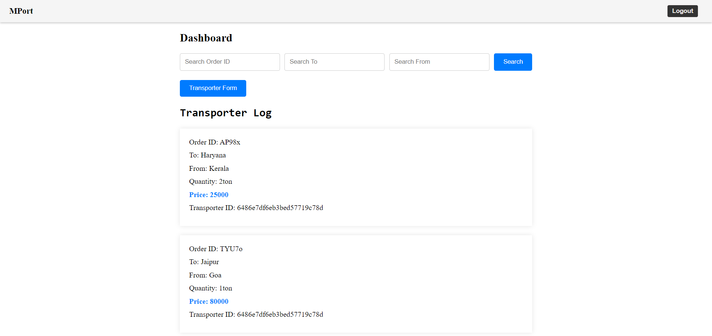
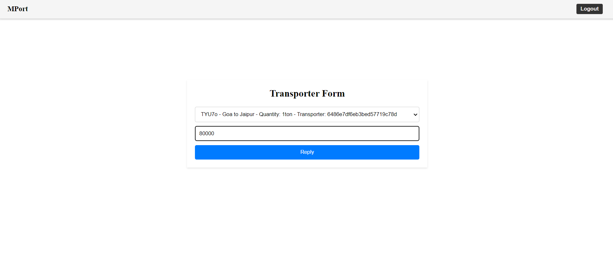
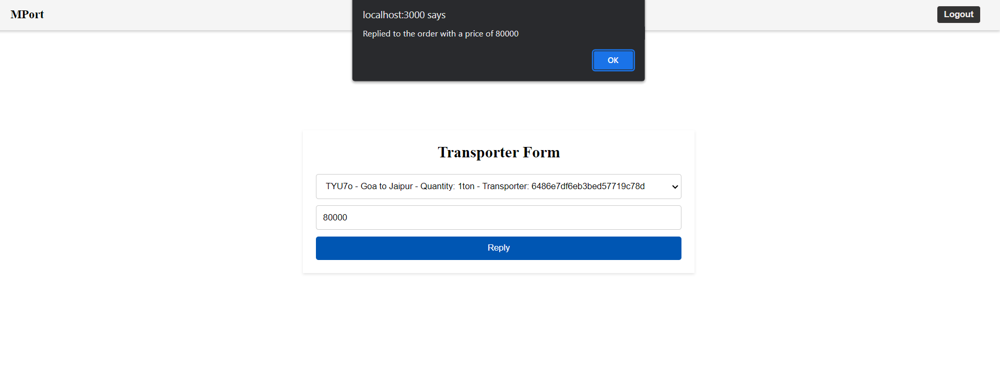

# MPort

## Description
MPort works for ease of communication and dealing between manufacturers and transporters for assigning orders to transporters, and transporters can reply with their desired prices. It streamlines the process of managing ports and facilitates efficient cargo transportation and logistics management.

## Technologies Used
- Backend: Node.js, Express.js, MongoDB
- Frontend: React.js, HTML, CSS
- Database: MongoDB

## Screenshots

### Home Page

Description: The home page of the website.

### Login

Description: The login page allows users to authenticate and access their accounts.

### Register

Description: The register page enables new users to create an account and join the system.

### Manufacturer Dashboard

Description: The manufacturer dashboard provides an interface for manufacturers to manage their orders and communicate with transporters.

### Manufacturer Form (Assign Orders)

Description: The manufacturer form allows manufacturers to assign orders to specific transporters by providing order details and selecting a suitable transporter.

### Transporters Dashboard

Description: The transporters dashboard displays a list of assigned orders for transporters, allowing them to view order details and submit price quotes.

### Transporters Form (Reply for Order)

Description: The transporters form enables transporters to reply to assigned orders by submitting their price quotes.

## How to Run

### Backend
1. Navigate to the backend directory: `cd backend`
2. Install the dependencies: `npm install`
3. Start the server: `npm start`

The backend server will run on http://localhost:5000.

### Frontend
1. Navigate to the frontend directory: `cd frontend`
2. Install the dependencies: `npm install`
3. Start the development server: `npm start`

The frontend development server will run on http://localhost:3000.

Note: Make sure you have MongoDB installed and running locally or provide the MongoDB connection details in the backend configuration.
